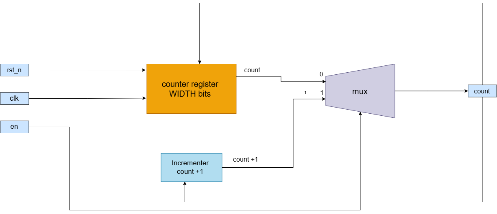
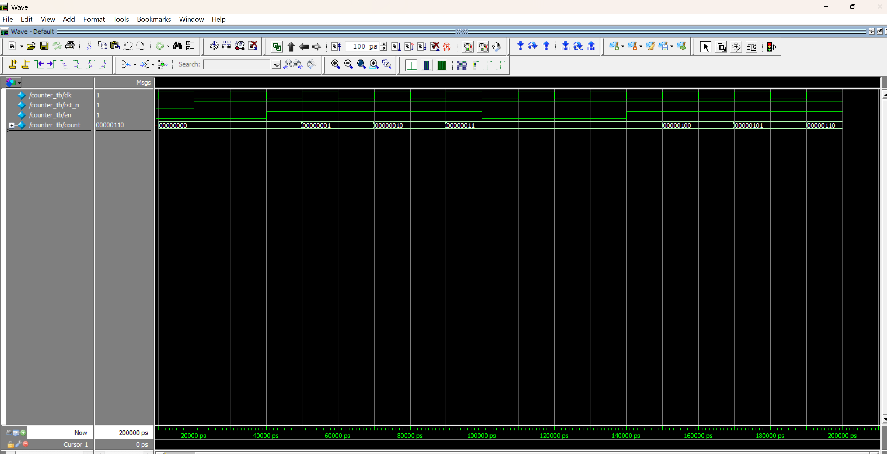
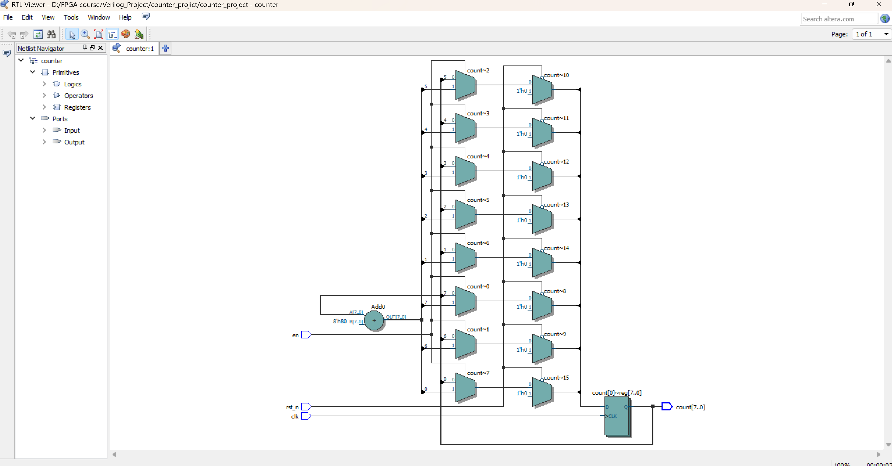
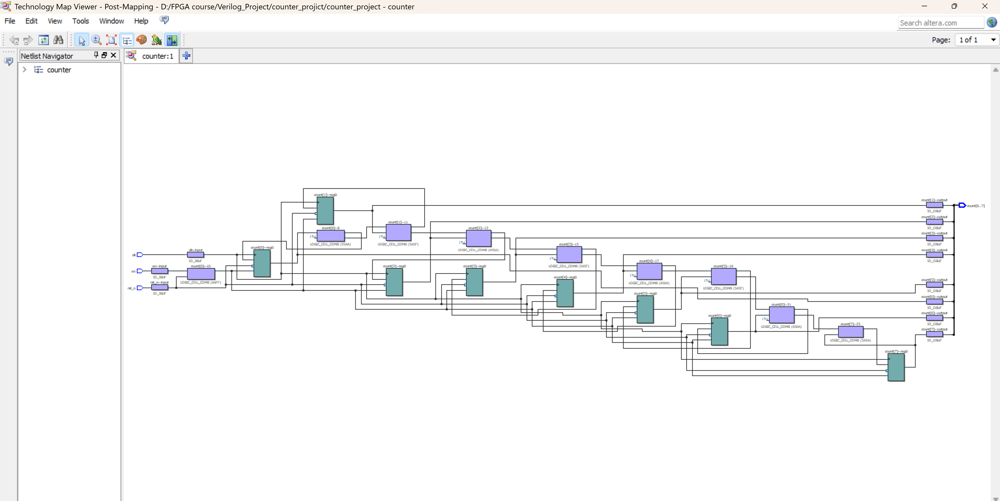

# Verilog Counter

A synchronous digital counter designed and implemented using **Verilog HDL**.

The project includes the RTL design, a dedicated testbench, timing constraints, architecture documentation, simulation results, and synthesis views.

---

## Overview

This project demonstrates the design and verification of a digital counter using Verilog HDL.

The design is driven by a clock signal and includes reset functionality. The counter behavior is verified through simulation using a dedicated Verilog testbench.

The project follows a structured RTL design and verification workflow.

---

## Features

- Synchronous digital counter
- Clock-driven operation
- Reset functionality
- Verilog RTL implementation
- Dedicated simulation testbench
- Timing constraints using SDC
- RTL synthesis visualization
- Technology mapping visualization
- Simulation waveform documentation

---

## Architecture

The counter is implemented as a synchronous sequential digital circuit.

The main functional elements of the design include:

- Clock input
- Reset input
- Counter logic
- Counter output

The architecture diagram illustrates the relationship between the input signals, sequential logic, and counter output.

### Architecture Diagram



The original editable architecture file is also provided:

`Architecture/counter_architecture.drawio`

---

## RTL Design

The main counter implementation is located in the `RTL` directory.

```text
RTL/
└── counter.v
```

The Verilog RTL describes the required sequential logic and counter behavior.

---

## Verification

A dedicated Verilog testbench is provided to verify the functionality of the counter.

```text
Testbench/
└── counter_tb.v
```

The testbench applies clock and reset conditions and monitors the counter output to verify the expected behavior.

---

## Simulation Results

The counter functionality was verified through RTL simulation.

### Simulation Waveform



The waveform demonstrates the relationship between the clock, reset, and counter output during simulation.

---

## RTL Viewer

The RTL Viewer provides a graphical representation of the hardware inferred from the Verilog RTL description.



---

## Technology Mapping

The technology mapping view shows the hardware resources and logic structure generated during the synthesis and mapping process.



---

## Timing Constraints

Timing constraints are provided using an SDC file.

```text
constrains/
└── counter.sdc
```

The SDC file contains the timing constraints required for timing analysis of the design.

---

## Project Structure

```text
verilog-counter/
│
├── Architecture/
│   ├── counter_architecture.drawio
│   └── counter_architecture.png
│
├── RTL/
│   └── counter.v
│
├── Testbench/
│   └── counter_tb.v
│
├── constrains/
│   └── counter.sdc
│
├── images/
│   ├── counter_MAP_Veiwer.png
│   └── counter_RTL_Viewer.png
│
├── waveforms/
│   └── counter_waveform.png
│
└── README.md
```

---

## Tools Used

- **Verilog HDL**
- **Intel Quartus**
- **ModelSim / RTL Simulation**
- **draw.io** for architecture documentation

---

## Design Flow

The project follows the general RTL development flow:

```text
RTL Design
    ↓
Testbench
    ↓
Simulation
    ↓
RTL Analysis
    ↓
Synthesis
    ↓
Technology Mapping
    ↓
Timing Analysis
```

---

## Project Status

**Completed**

The RTL design, verification environment, simulation results, architecture documentation, and synthesis views are included in this repository.

---

## Author

**Sayed Sleam**

Computer & Systems Engineering Student

---

## License

This project is provided for educational and learning purposes.
